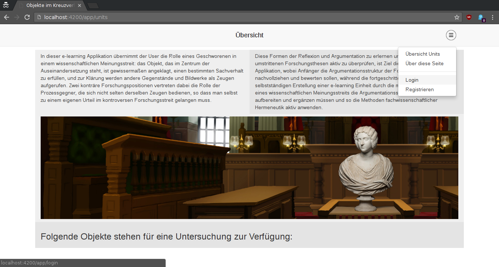
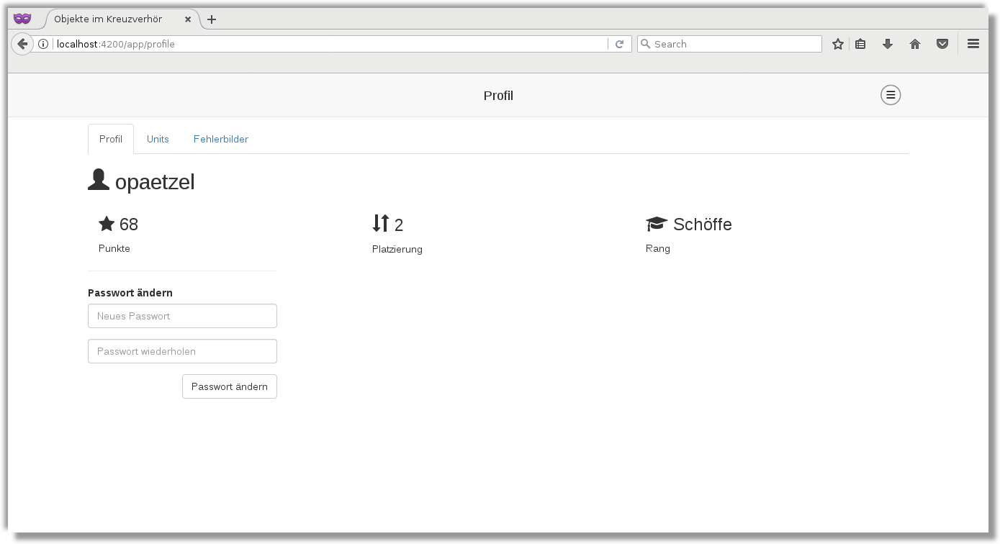
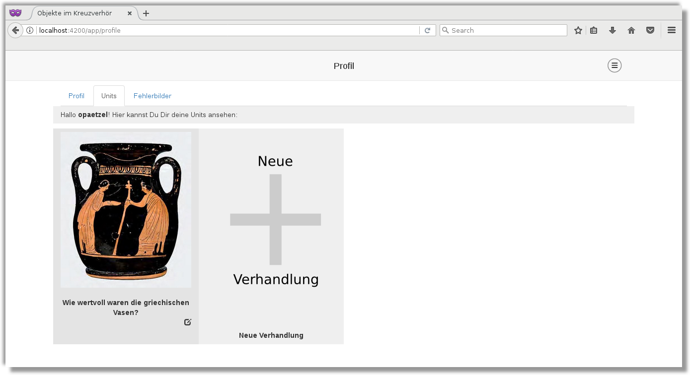
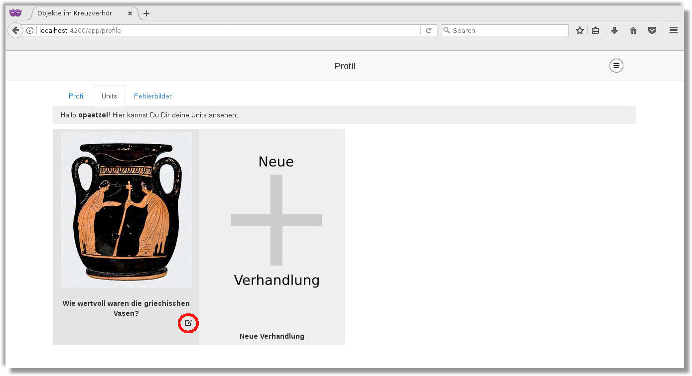
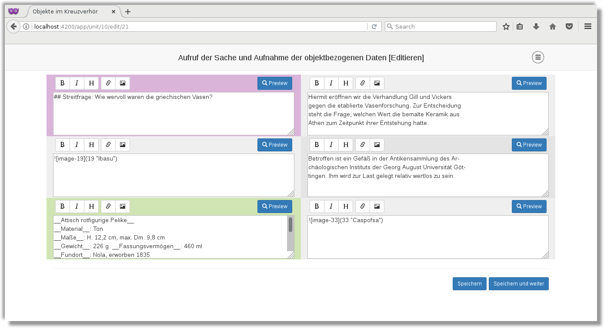
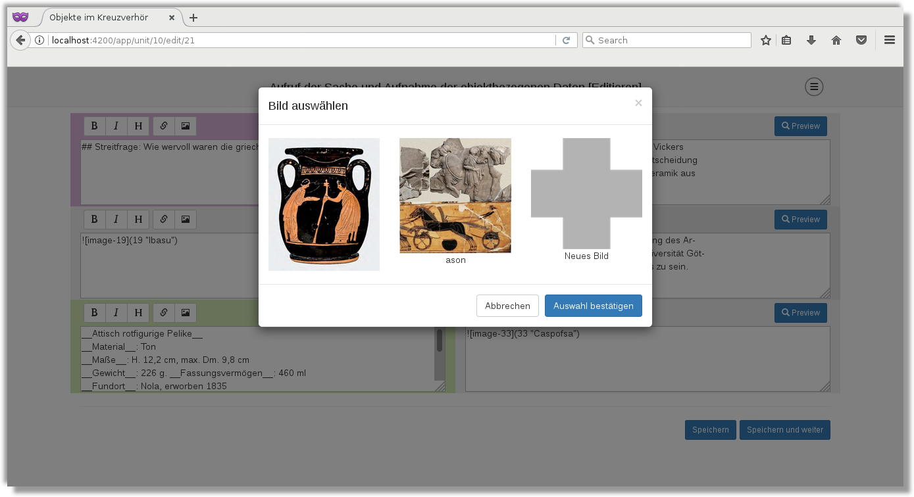
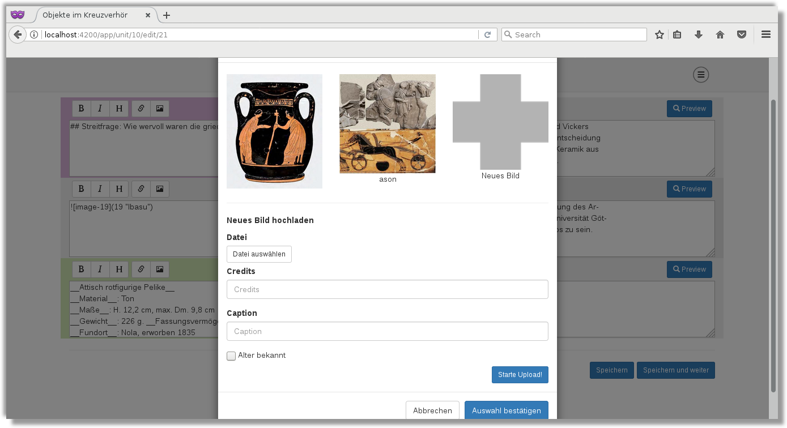

# Dokumentation für Editoren

Diese Dokumentation richtet sich an Editoren, das heißt die Personen, die neue Verhandlungen erstellen wollen.

## Login und neue Verhandlung anlegen

Nachdem Sie sich registriert haben und als Editor freigeschaltet wurden, können Sie sich einloggen und neue units erstellen.
Um sich einzuloggen, navigieren sie über das Menü oben rechts auf die Login-Seite:


Dort loggen Sie sich bitte mit Ihrem Benutzernamen und Passwort ein. Sie werden direkt zu Ihrem Profil weitergeleitet:



Über den Reiter "Units" gelangen Sie zu Ihren Units.  



Schon angelegte units können Sie über den kleinen edit Butten rechts unter dem Bild editieren:



Mit einem Klick auf "Neue Verhandlung" wird eine neue Verhandlung angelegt. Auf der folgenden Seite müssen einige Informationen über die neue Verhandlung eingegeben werden:


Das "Rotationsbild" muss als "tar.gz"-Archiv hochgeladen werden, in dem auf unterster Ebene (kein Unterordner) die alphabetisch (nach Dateinamen) sortierten Bilder liegen.  
Dieses Archiv kann mit dem folgenden Thumbnail-Generator einfach erzeugt werden: [oik-thumbnailer](https://github.com/opaetzel/oik-thumbnailer/releases/tag/v0.9)  
Dieses Programm besitzt zwar keine GUI, tut aber auch in der Kommandozeile genau das was wir wollen. Es gibt drei Versionen, eine für Linux, eine für MacOS und eine für Windows. 
Die jeweils passende Version kann auf der oben verlinkten Seite heruntergeladen werden. Um das Tool zu benutzen, müssen wir zunächst einen Terminal öffnen. Dann navigieren wir zu der vorher heruntergeladenenen Datei und führen sie mit den gewünschten Parametern aus:
```bash
cd /path/to/download/dir
./oik-thumbnailer-macos -dim 1600x1600 -input /path/to/folder/containing/images -output my-images.tar.gz
```
Das Programm skaliert die Bilder im angegebenen input Ordner so, dass sie in die angegebenen Dimensionen passen und schreibt sie in das Archiv-Format, das unsere Anwendung benötigt (tar.gz).

Wenn alles eingegeben und hochgeladen ist, mit einem Klick auf "Speichern und weiter" fortfahren.

## Die Seiten bearbeiten
Der Inhalt der eigentlichen Verhandlung ist in verschiedene Teile aufgeteilt:

- Aufruf der Sache und Aufnahme der objektbezogenen Daten (1 Seite)
- Referat der Streitfrage (1 Seite)
- Beweisaufnahme (Maximal 6)
- Synthese (1 Seite)
- Literatur (1 Seite)

Die Anwendung generiert bei einem Klick auf "Speichern und Weiter"  automatisch eine Vorlage für die nächste Seite. Auf den "Beweisaufnahme" Seiten stehen zusätzlich noch die Buttons "Neue Zeile" und "Speichern und Synthese"
zur Verfügung. Der "Neue Zeile" Button tut das, was er sagt: Es wird eine neue Zeile auf der aktuellen Seite erzeugt.  
Auf "Speichern und Synthese" sollten Sie hier klicken, wenn Sie mit der Beweisaufnahme abgeschlossen haben und keine weiteren Beweisaufnahme-Seiten erstellen wollen.


### Text eingeben
Der eigentliche Text wird per Markdown-Syntax eingegeben. Eine gute Markdown-Referenz kann hier gefunden werden: [Markdown-Cheatsheet](https://github.com/adam-p/markdown-here/wiki/Markdown-Cheatsheet)  
Das generelle Text-Markup (also die jeweilige Größe der Überschriften und fett geschriebene Textstellen) ist immer bereits vorausgefüllt. Bitte halten Sie sich an diese Vorgaben, damit das Styling später in der Anzeige
richtig greift.

### Bilder
Bilder werden über die Markdown-Syntax eingetragen, allerdings per interner ID referenziert. Für die Bilder gibt es einen Helfer-Dialog, über den Bilder hochgeladen und ausgewählt werden können:

Zunächst das Bild-Icon über dem Textfeld in das das Bild eingefügt werden soll anklicken. 



Es öffnet sich der Bild-Dialog:



Wenn ein schon vorher hochgeladenes Bild ausgewählt werden soll, einfach das Bild anklicken und unten die Auswahl bestätigen:


Für ein neues Bild auf den Button "Neues Bild" klicken, dann ein Bild auswählen und es hochladen:


