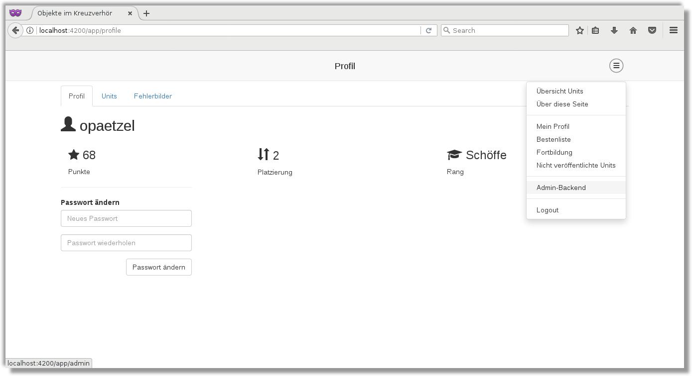
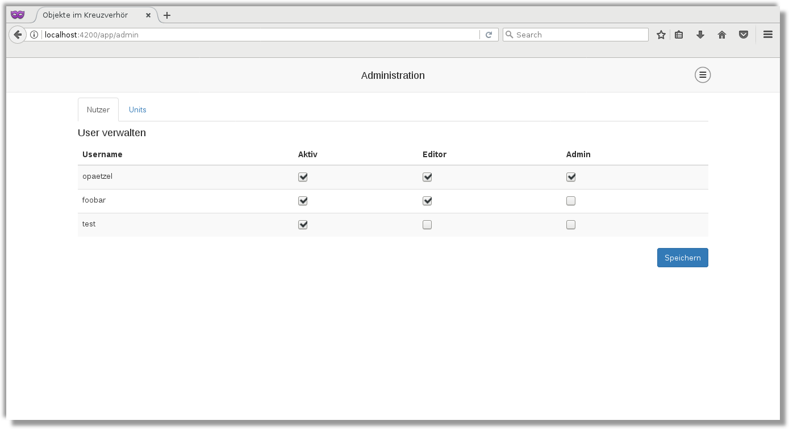
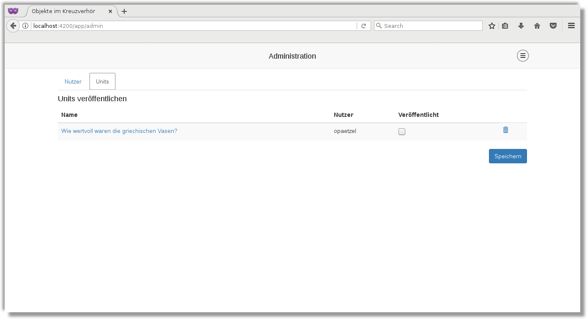

#Site-Admin Dokumentation

Das Admin-Interface kann über das Menü erreicht werden. Dazu müssen Sie eingeloggt sein:

Hier können Units veröffentlicht und Nutzer verwaltet werden. Die User werden im Tab "Nutzer" verwaltet:

Im Units-Menü können Units veröffentlicht werden:

